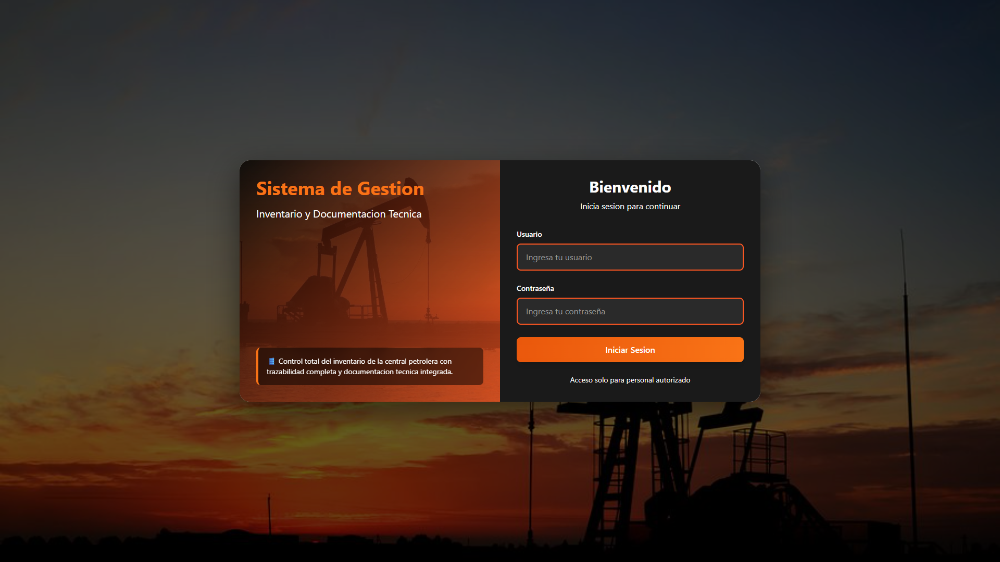
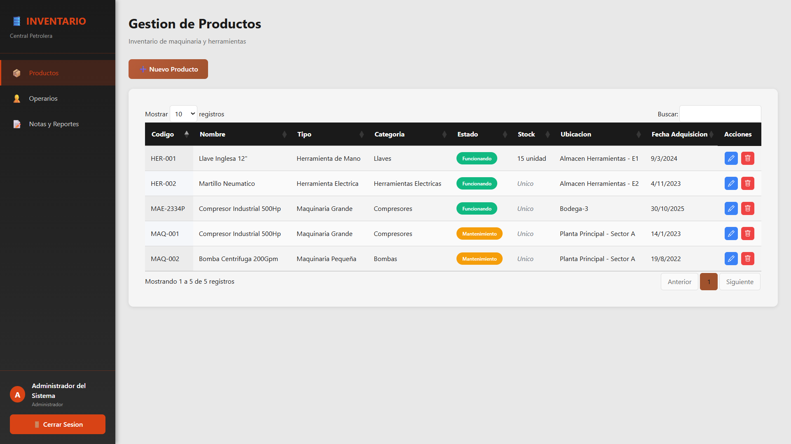
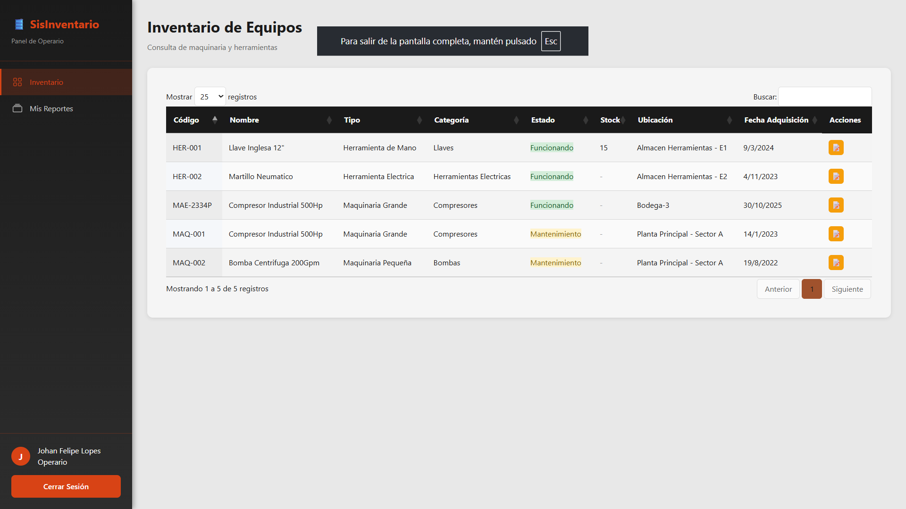

<div align="center">

# 🛢️ Sistema de Inventario Petrolera

### Sistema de gestión integral para control de inventario y reportes de mantenimiento

[](https://www.python.org/downloads/)
[](https://flask.palletsprojects.com/)
[](https://www.mysql.com/)
[](https://opensource.org/licenses/MIT)

[Características](#-características) • [Demo](#-capturas-de-pantalla) • [Instalación](#-instalación-local) • [Tecnologías](#-tecnologías)

</div>

---

## 📖 Descripción

Sistema web completo diseñado para la **gestión de inventario y documentación técnica** en centrales petroleras. Incluye autenticación JWT, control de roles (Admin/Operario), sistema de reportes de mantenimiento y despliegue automatizado con Docker.

## ✨ Características

🔐 **Autenticación Segura**
- Login con JWT (tokens de 24 horas)
- Encriptación Bcrypt para contraseñas
- Control de acceso basado en roles

📦 **Gestión de Inventario**
- CRUD completo de artículos
- Control de stock mínimo
- Filtros y búsqueda avanzada
- DataTables interactivas

📝 **Sistema de Reportes**
- 4 tipos: Falla, Mantenimiento, Observación, Solicitud
- 4 estados: Pendiente, En Revisión, Resuelto, Cerrado
- Historial completo con timestamps

👥 **Gestión de Usuarios**
- Roles: ADMIN (gestión completa) y USER (solo lectura)
- Administración de permisos
- Interfaz intuitiva

## 📸 Capturas de Pantalla

### Login Responsive
<div align="center">
  
  <p><em>Interfaz de login adaptable a todos los dispositivos</em></p>
</div>

### Dashboard Administrador
<div align="center">
  
  <p><em>Panel de control con gestión completa de inventario, usuarios y reportes</em></p>
</div>

### Dashboard Operario
<div align="center">
  
  <p><em>Vista de solo lectura del inventario para operarios</em></p>
</div>

## 🚀 Tecnologías

```
Sis.Inventary/
├── backend/
│   ├── config/
│   │   ├── config.py          # Configuración (SECRET_KEY, DB)
│   │   └── database.py        # Conexión SQLAlchemy
│   ├── models/
│   │   ├── user.py            # Modelo Usuario
│   │   ├── article.py         # Modelo Artículo
│   │   └── report.py          # Modelo Reporte
│   ├── routes/
│   │   ├── auth_routes.py     # Login/Registro
│   │   ├── users_routes.py    # CRUD Usuarios
│   │   ├── articles_routes.py # CRUD Inventario
│   │   ├── report_routes.py   # CRUD Reportes
│   │   └── main_routes.py     # Rutas frontend
│   └── app.py                 # Aplicación Flask
├── frontend/
│   ├── templates/
│   │   ├── admin/
│   │   │   └── dashboard.html # Dashboard Admin
│   │   ├── operario/
│   │   │   └── dashboard.html # Dashboard Operario
│   │   ├── login.html         # Página de login
│   │   ├── diagnostico.html   # Herramientas debug
│   │   └── clear-session.html # Limpiar sesión
│   └── static/
│       ├── css/
│       │   └── styles.css     # Estilos globales
│       └── js/
│           ├── api.js         # Cliente API REST
│           ├── auth.js        # Utilidades autenticación
│           ├── dashboard-admin.js
│           ├── dashboard-operario.js
│           ├── users-management.js
│           └── reports-management.js
├── database/
│   └── init.sql               # Schema + datos de prueba
├── tests/
│   ├── __init__.py
│   └── test_health.py         # Tests básicos
├── .github/
│   └── workflows/
│       └── ci-cd.yml          # Pipeline CI/CD
├── Dockerfile                 # Imagen Docker
├── docker-compose.yml         # Orquestación
├── railway.json               # Config Railway
├── runtime.txt                # Python 3.11
├── requirements.txt           # Dependencias Python
├── .dockerignore
├── .gitignore
├── DEPLOYMENT.md              # Guía de despliegue
├── DEVOPS_SETUP.md            # Documentación DevOps
└── README.md


| **Backend** | **Frontend** | **Database** | **DevOps** |
|-------------|--------------|--------------|------------|
| Python 3.11 | HTML5/CSS3 | MySQL 8.0 | Docker |
| Flask 3.0.0 | Tailwind CSS 3.4 | SQLAlchemy 3.1 | GitHub Actions |
| Flask-Bcrypt | JavaScript ES6 | PyMySQL | Railway.app |
| PyJWT | jQuery 3.7 | - | Gunicorn 21.2 |
| Flask-CORS | DataTables 1.13 | - | - |

## 🚀 Instalación Local

### Requisitos Previos
- Python 3.11+
- MySQL 8.0+ (XAMPP recomendado)
- Git

### Pasos de Instalación

```bash
# 1. Clonar repositorio
git clone https://github.com/FelipeGar17/Sis.InventoryPetrolera.git
cd Sis.InventoryPetrolera

# 2. Crear entorno virtual
python -m venv venv
.\venv\Scripts\activate  # Windows
source venv/bin/activate # Linux/Mac

# 3. Instalar dependencias
pip install -r requirements.txt

# 4. Configurar MySQL
# Iniciar MySQL en XAMPP e importar database/init.sql

# 5. Configurar variables (.env)
DB_HOST=localhost
DB_USER=root
DB_PASSWORD=
DB_NAME=inventario_petrolera
SECRET_KEY=tu-clave-secreta

# 6. Ejecutar aplicación
python run.py
```

🌐 Abre tu navegador en **http://localhost:5000**

### 👤 Usuarios de Prueba

| Rol | Usuario | Contraseña |
|-----|---------|------------|
| **Admin** | `admin` | `admin123` |
| **Operario** | `jfelipe` | `123456` |

## 🐳 Docker

```bash
# Construir y ejecutar
docker-compose up --build

# Detener
docker-compose down
```

## 📁 Estructura del Proyecto

```
Sis.Inventary/
├── backend/              # Lógica del servidor
│   ├── models/          # Modelos SQLAlchemy
│   ├── routes/          # Endpoints API
│   └── config/          # Configuración y DB
├── frontend/            # Interfaz de usuario
│   ├── templates/       # HTML Jinja2
│   └── static/          # CSS/JS/Assets
├── database/            # Scripts SQL
├── screenshots/         # Capturas para README
├── tests/               # Tests unitarios
├── docker-compose.yml   # Orquestación Docker
└── requirements.txt     # Dependencias Python
```

## 🔐 Autenticación

El sistema implementa **autenticación JWT** con las siguientes características:

- 🔒 **Bcrypt**: Encriptación de contraseñas con salt
- 🎫 **JWT**: Tokens de sesión con expiración de 24 horas
- 🛡️ **Roles**: Control de acceso basado en permisos (ADMIN/USER)
- 🚪 **Redirección**: Automática según rol después del login

## 📊 Funcionalidades por Rol

### 👨‍💼 Administrador
- ✅ Gestión completa de inventario (CRUD)
- ✅ Administración de usuarios
- ✅ Gestión y respuesta de reportes
- ✅ Acceso a todas las funcionalidades

### 👷 Operario
- ✅ Visualización de inventario (solo lectura)
- ✅ Creación de reportes de mantenimiento
- ✅ Consulta de historial de reportes
- ❌ Sin permisos de edición

## 🌐 Despliegue en Producción

### Railway.app (Recomendado)

1. Conecta tu repositorio de GitHub
2. Agrega servicio MySQL
3. Configura variables de entorno
4. Deploy automático

📖 Ver guía completa en [DEPLOYMENT.md](DEPLOYMENT.md)

## 🧪 Testing

```bash
# Ejecutar todos los tests
pytest

# Con reporte de cobertura
pytest --cov=backend --cov-report=html
```

## 📝 Licencia

Este proyecto está bajo la Licencia MIT.

## 👨‍💻 Autor

**Felipe García** - [GitHub](https://github.com/FelipeGar17) | [LinkedIn](https://linkedin.com/in/FelipeGar17)

---

<div align="center">

**⭐ Si este proyecto te fue útil, considera darle una estrella ⭐**

[](https://github.com/FelipeGar17/Sis.InventoryPetrolera)

</div>
